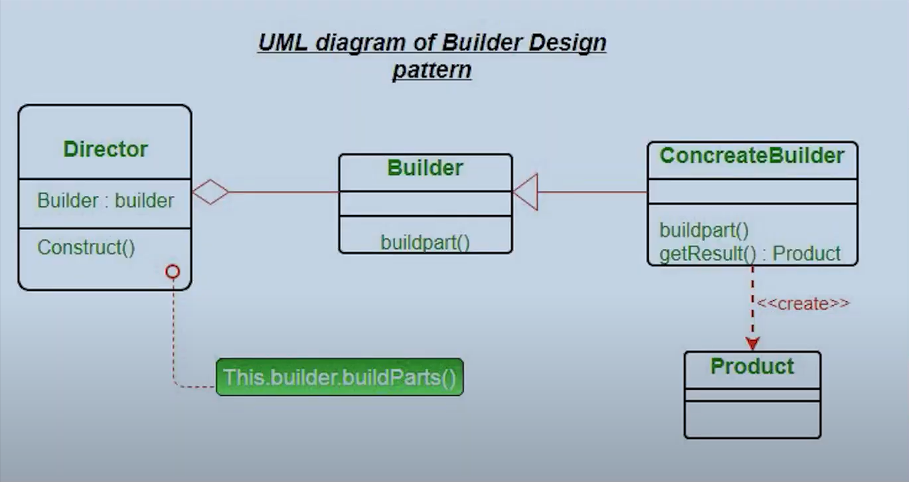

1) It can be used when we want to build a complext object.
2) Lets take an example of building vehicle, we build parts of it and bring all of them together to build vehicle[Ex: Car has engine, tyres, Music system], Desktop [ Monitor, CPU, Mouse, RAM, ROM....etc].
3) Builder[Desktop builder] is an interface for concrete builder[HP, DELL, APPLE....], 
4) Director, will be a component, which will orchestrate the Builder.

Commands:

g++ -c .\dell_desktop_builder.cpp .\desktop.cpp .\hp_desktop_builder.cpp
ar r builder.a dell_desktop_builder.o desktop.o hp_desktop_builder.o builder.a
g++ -o client .\client.cpp builder.a 

#ifndef is used to check if the header is already defined, it will be added
if its not added already.

